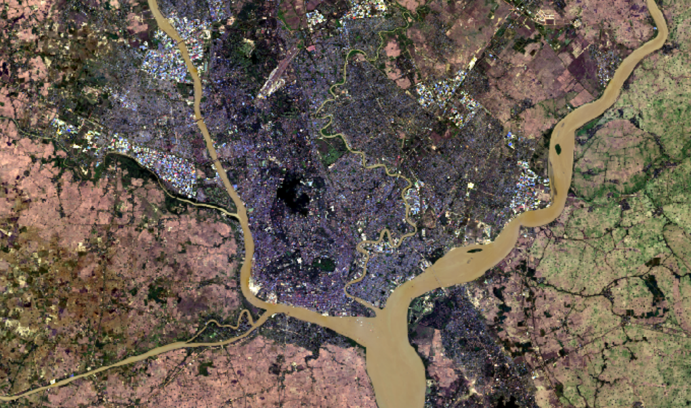
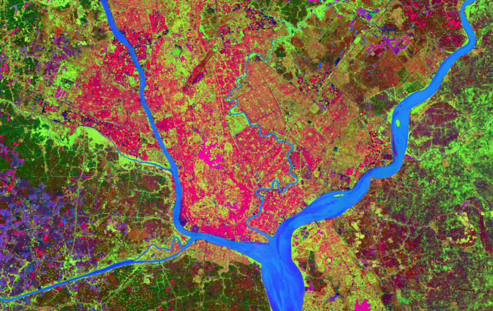
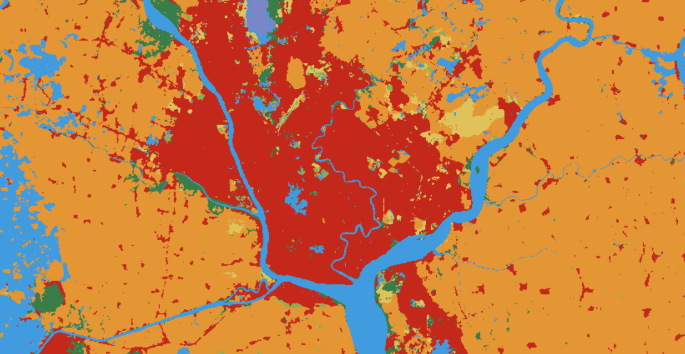
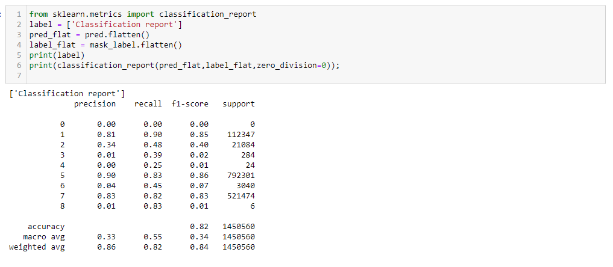

# Landsat_9_LC_classification
# Landcover classification using Landsat 9

## Project Structure
The descriptions of principal files in this project are introduced as follows:
* training_data : include training_data_points that are randomly scattered across the area of interest. The values of Label image (ESRI landcover image ) and training image (Landsat 9 ( Multispectral and PCA reduced Image)) are extracted to randomly scattered training points. Training points are converted to excel data for modelling 

* Landsat 9 classification.ipynb : notebook for training Random forest model
  
## Principal Environmental Dependencies
* sklearn
* numpy
* pandas
* geopandas
* rasterio
* matplotlib

## Original Landsat 9 True Color Composite 
 

## PCA performed Image
  
 
## Random Points over label data
  

## Classification Report
 

## OutPut Landcover Map
 
